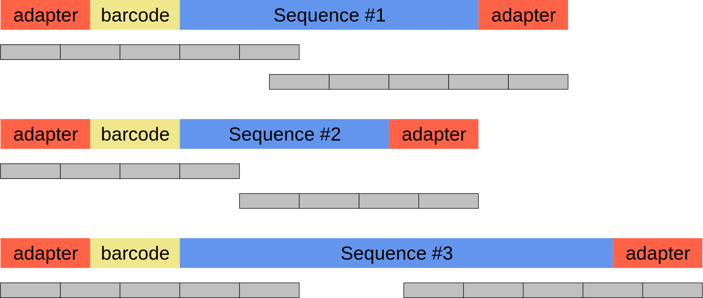
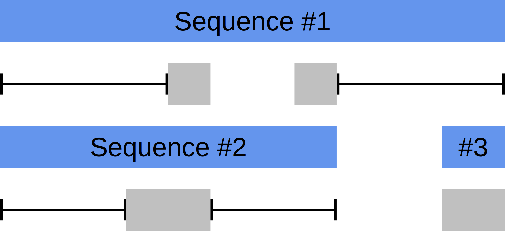

==========================
Module option explanations
==========================

Adapter Content Module
----------------------

The adapter content module searches for adapter stubs that are 12 bp in length.
These adapter probes are saved in the default adapter file which has the
following structure:

.. csv-table:: adapter_file.tsv
    :header: "#Name", "Sequencing Technology", "Probe sequence", "sequence position"

    "Illumina Universal Adapter", "illumina", "AGATCGGAAGAG", "end"
    "Illumina Small RNA 3' adapter", "illumina", "TGGAATTCTCGG", "end"

All empty rows and rows starting with ``#`` are ignored. The file is tab
separated. The columns are as follows:

+ Name: The name of the sequence that shows up in the report.
+ Sequencing Technology: The name of the technology, currently ``illumina``,
  ``nanopore`` and ``all`` are supported. Sequali detects the technology from
  the file header and only loads the appropriate adapters and adapters with
  ``all``.
+ Probe sequence: the sequence to probe for. Can be up to 64 bp in length.
  Since exact matching is used false postives versus false negatives need to
  be weighed when considering probe length.
+ Sequence position: Whether the adapter occurs at the begin or end. In the
  resulting adapter graph, counts for this adapter will accumulate towards the
  begin or end depending on this field.

A new adapter file can be set with the ``--adapter-file`` flag on the CLI.

Overrepresented Sequences Module
----------------------------------
Determining overrepresented sequences is challenging. One way is to take
all the k-mers of each sequence and count all the k-mer occurences. To avoid
issues with read orientation the canonical k-mers should be taken [#F1]_.
Storing all kmers and counting them is very compute intensive as a k-mer has to
be calculated and stored for every position in the sequence.

Sequali therefore divides a sequence in fragments of length k. Unlike k-mers
which are overlapping, this ensures that each part of the sequence is
represented by just one fragment. The disadvantage is that these fragments
can be caught in different frames, unlikely k-mers which capture all possible
frames for length k. This hampers the detection rate.

Since most overrepresented sequences will be adapter and helper sequences
and since most of these sequences will be anchored at the beginning and end
of the read, this problem is alleviated by capturing the fragments from the
ends towards the middle. This means that the first and last fragment will
always be the first 21 bp of the beginning and the last 21 bp in the end. As
such the adapter sequences will always be sampled in the same frame.

    This figure shows how fragments are sampled in sequali. The silver elements
    represent the fragments. Sequence #1 is longer and hence more fragments are
    sampled. Despite the length differences between sequence #1 and sequence #2
    the fragments for the adapter and barcode sequences are the same.
    In Sequence #1 the fragments sampled from the back end overlap somewhat
    with sequences from the front end. This is a necessity to ensure all of the
    sequence is sampled when the length is not divisible by the size of the
    fragments.

Fragments are stored and counted in a hash table. When the hash table is full
only fragments that are already present will be counted. To diminish the time
spent on the module, by default 1 in 8 sequences is analysed.

After the module is run, stored fragments are checked for their counts. If the
count exceeds a certain threshold it is considered overrepresented. Sequali
does a k-mer analysis of the sequences and compares that with sequences from
the NCBI UniVec database to determine possible origins.

The following command line parameters affect this module:

+ ``--overrepresentation-threshold-fraction``: If count / total exceeds this
  fraction, the fragment is considered overrepresented.
+ ``--overrepresentation-min-threshold``: The minimum count to be considered
  overrepresented.
+ ``--overrepresentation-max-threshold``: The maximum count to be considered
  overrepresented. On large libraries with billions of sampled fragments this
  can be used to force detection for certain counts regardless of threshold.
+ ``--overrepresentation-max-unique-fragments``: The amount of fragments to
  store.
+ ``--overrepresentation-sample-every``: How often a sequence is sampled. Default
  is every 8 sequences.

.. [#F1] A canonical k-mer is the k-mer that has the lowest sort order compared
         to itself and its reverse complement. This way the canonical-kmer is
         always the same regardless if it, or its reverse complement are read.
         This is useful to identify sequences regardless of orientation.

Duplication Estimation Module
-----------------------------
Properly evaluating duplication in a reference-free fashion requires an
all-to-all alignment of sequences and using a predefined set of criteria to
ascertain whether the sequences are duplicates. This is unpractical.

For a practical estimate it is common practice to take a small part of the
sequence as a fingerprint and use a hash table to store and count fingerprints.
Since the fingerprint is small, sequence errors do not affect it heavily. As
such this can provide a reasonable estimate, which is good enough for detecting
problematic libraries.

Sequali's fingerprints by collecting a small sample from the front and back
of the sequence. To avoid adapter sequences, the samples are taken at an
offset. If the sequence is small, the offsets are sunk proportionally. If the
sequence is smaller than the sample sequence lenghts, its entire length
is sampled. Paired sequences are sampled at the beginning of both its sequences
without an offset, since adapter sequences for illumina sequences are closer
to the end.

    Sequali fingerprinting. Small samples are taken from the front and back
    of the sequence at an offset. Sequence #1 shows the common situation where
    the sequence is long. Sequence #2 is smaller than the combined length of
    the offsets and the samples, so the offsets are shrunk proportionally.
    Sequence #3 is smaller than the sample length, so its sampled entirely.
    Sequence #4 is paired, so samples are taken from the beginning of R1 and
    R2.

The sampled sequences are then combined into one and hashed. The hash
seed is determined by the sequence length integer divided by 64. The resulting
hash is the fingerprint.

Since not all fingerprints can be counted due to memory constraints, `a hash
subsampling technique from the file storage world
<https://www.usenix.org/system/files/conference/atc13/atc13-xie.pdf>`_ is used.

This technique first counts all the fingerprints. Then when the hash table is
full, a new hash table is created. The already counted fingerprints are inserted
but only if the last bit of the hash is ``0``. This eliminates on average half
of the fingerprints. The fingerprinting and counting is then continued, but
only hashes that end in ``0`` are considered. If the hash table is full again,
the process is repeated but now only hashes that end with the last two bits
``00`` are considered, and so on.

The advantage of this technique is that it subsamples
only part of the fingerprints which is good for memory usage.
As stated in the paper, unlike subsampling only the fingerprints from the
beginning of the file, this technique is much less biased towards unique
sequences.

The following command line options affect this module:

+ ``--duplication-max-stored-fingerprints``: The maximum amount of stored
  fingerprints. More fingerprints lead to more accurate estimates but also more
  memory usage.

These options can be used to control how the fingerprint is taken

+ ``--fingerprint-front-length``.
+ ``--fingerprint-back-length``.  For paired-end sequencing this is the length
  of the sample from from the beginning for R2.
+ ``--fingerprint-front-offset``.
+ ``--fingerprint-back-offset``. For paired-end sequencing this is the offset
  the sample from the beginning for R2.
