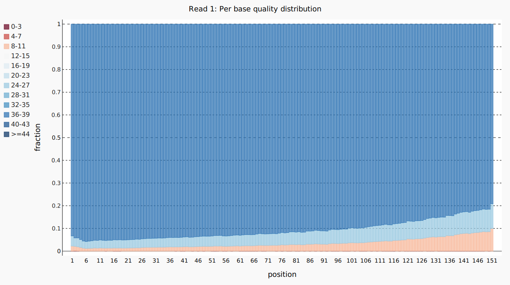
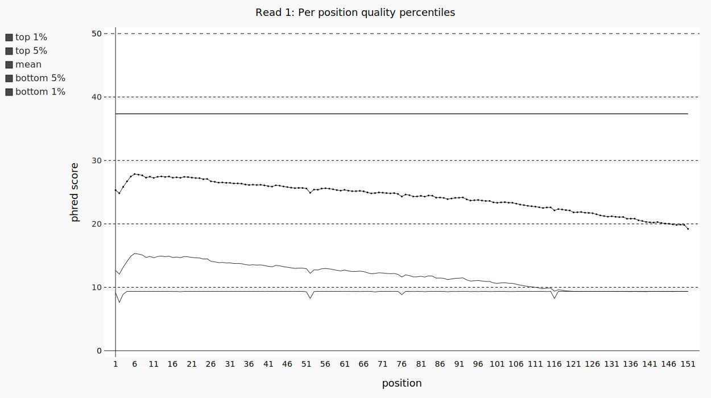
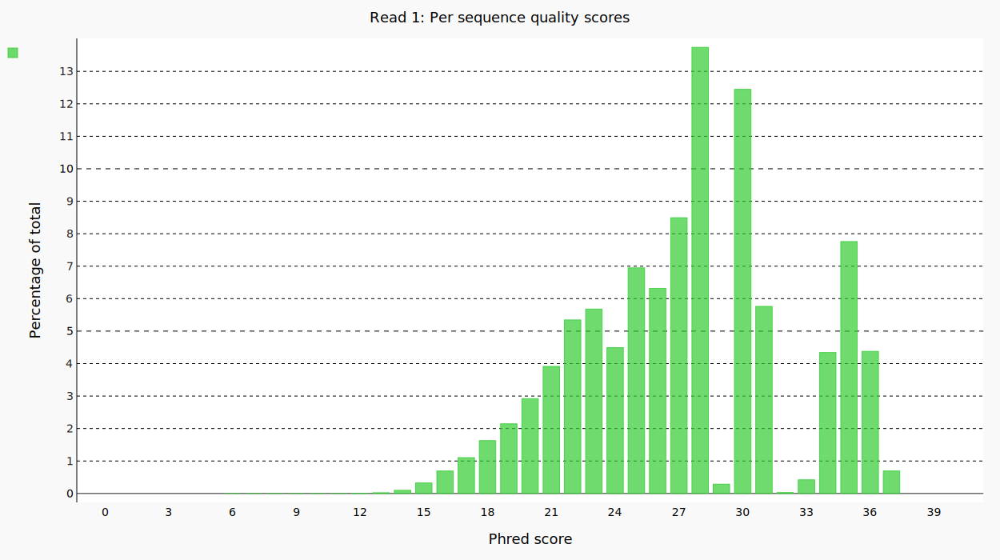
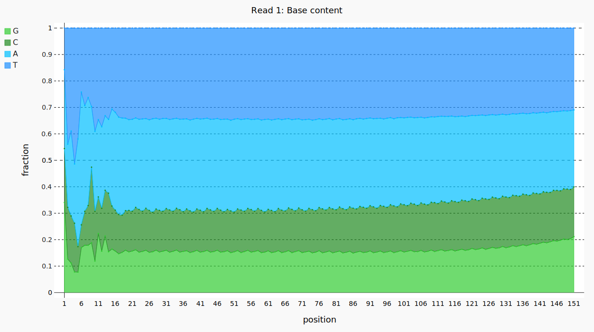
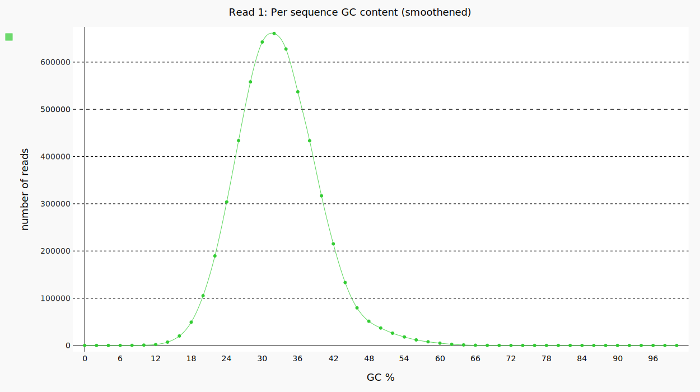

===========
User guides
===========

Illumina paired-end
-------------------

Usage
.....

Sequali can be run with

.. code-block::

    sequali my_fastq_R1.fastq.gz my_fastq_R2.fastq.gz

For illumina paired-end data.

Interpreting results
....................

For Illumina data it is fairly typical that more low quality bases get called
along the length of thread. Illumina data only uses four distinct qualities
(37,25,11,2) so that can be seen in the plot. As a result the average read
quality decreases.

The per read average quality plot will have a hedgehog-like appearance due
to low quality bases having a very considerable impact on the average quality
and illumina only using four distinct qualities.

.. note::

    Some tools show a different picture because they base their averages on the log
    values, not the underlying error rates.
    In a typical illumina example most of the reads will have a Phred score
    of 37. Let's take a read with 100 bases one of which is N and the others
    are good. It is already apparent that since one of the bases is unknown,
    the average quality of this read should be about 1 in 100 errors or a Phred
    score of 20. Tools which average the log will report:

    :math:`\frac{99 \cdot 37 + 1 \cdot 2}{100}=36.65`

    Sequali will report:

    :math:`-10 \cdot log_{10}\left( \frac{99 \cdot 10^{\frac{37}{-10}} + 1 \cdot 10^{\frac{37}{-10}}}{100}\right) = 21.87`

    This means that tools that average log values without calculating the
    underlying error rates will always overestimate the quality by orders of magnitude.

The per position base content plot should be fairly consistent over its length.
Big squiggles as presented here indicate that an overrepresented sequence is
present that distorts the base content composition at that plot. The image
below shows a squiggle at the start of the sequence.

For illumina it is advisable to use the the smoothened GC content plot. The
plot should show a distribution with a peak at the average GC content of the
library. When multiple peaks are present this indicates a contamination
(with adapters or otherwise). The image below shows an example of a good result.
(The data is not of human origin, otherwise a GC content around 40% is expected.)

